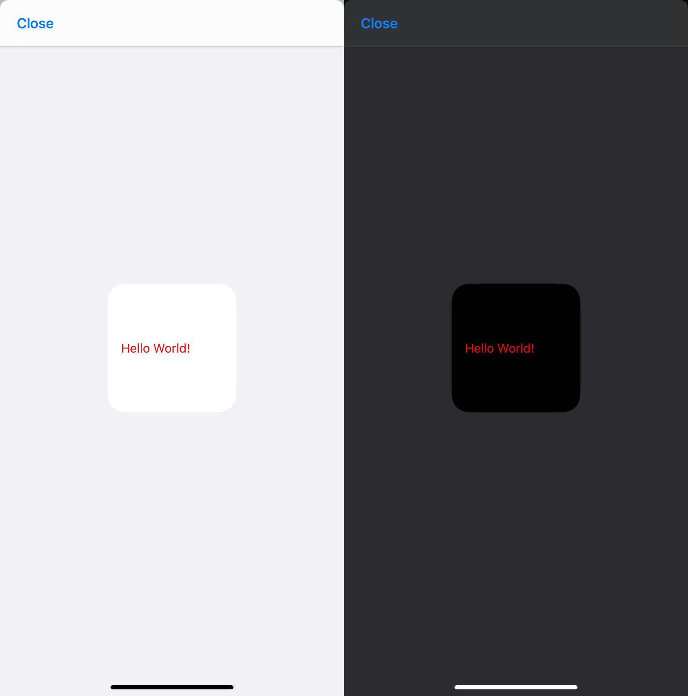
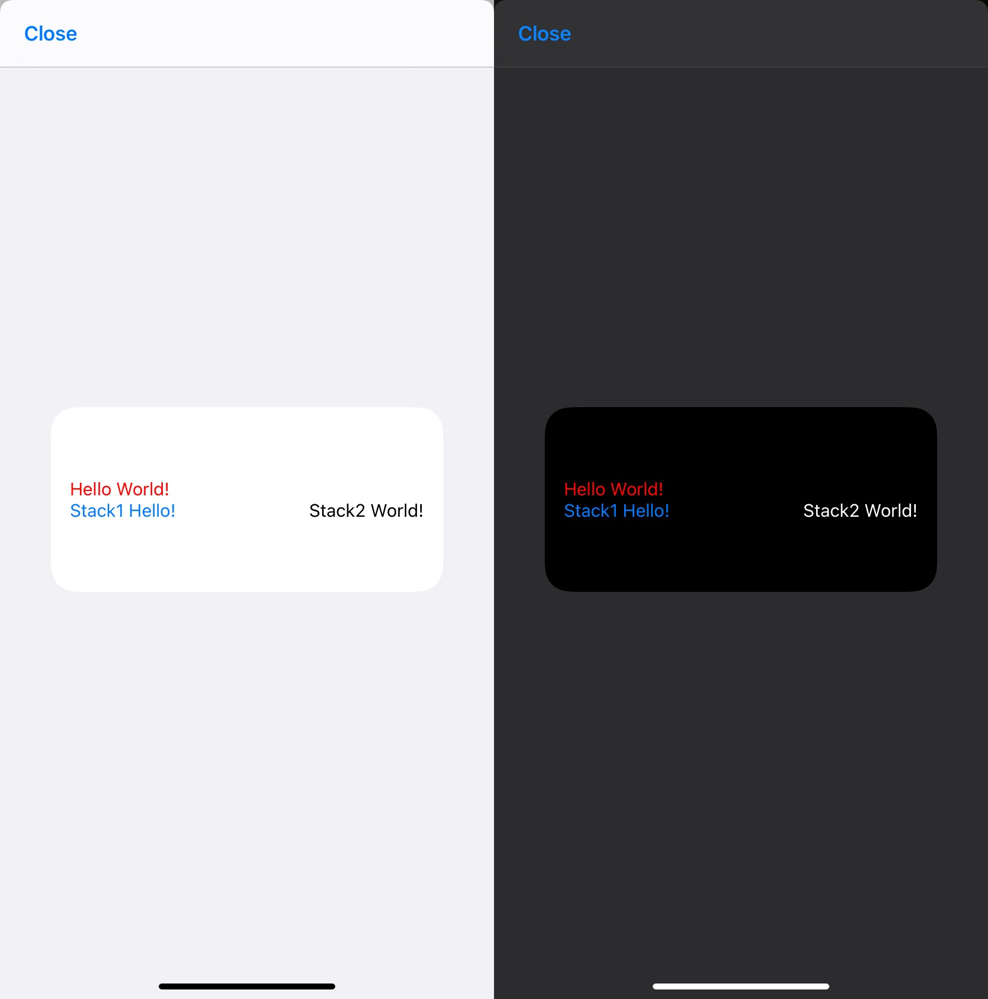

import useBaseUrl from '@docusaurus/useBaseUrl';

# Contents
* [intro](#intro)
* [using-widgettext](#using-widgettext)
* [example-code](#example-code)
* [widgettext-example-image](#widgettext-example-image)
* [adding-color](#adding-color)
* [example-code-1](#example-code-1)
* [widgettext-color-example-image](#widgettext-color-example-image)
* [adding-text-within-stacks](#adding-text-within-stacks)
* [example-code-2](#example-code-2)
* [widgettext-stack-example-image](#widgettext-stack-example-image)

## Intro

When starting a widget that you would like to display text on it often comes up that the script writer doesn't know how or where to place a given set of text to display.

There are a number of different ways we have to display text in a widget. The main ways to display text are as:

- WidgetText (using addText)
- Stack (using addText within a stack)
- DrawContext

### Using WidgetText

Let's cover the basic idea of how to add text to a widget. This code snippet is the minimal level needed to display basic text in a widget.

In the below example code, you can see that we first inialize the widget using 

`let w = new ListWidget()`, 

this assigns the variable w as our widget.
Next, we add the text as explained in the API documentation within the app, using the `ListWidget.addText` method. However, you can see 

`let text = w.addText('Hello World')`, 

we first assign the addText item to the variable `text`. The reason we do this, is because it allows us to modify the text characteristics (size, color, font, etc.). We will get to this later.

At the end of the script, it's always a good idea to set the widget, this will allow the widget to be displayed.

Following setting the widget, we call `Script.complete()` to tell the app the script is finished.

This is all that is needed at this point for the widget to work on the Home Screen, however, usually developers of widgets like to see a preview, for this reason, it's a good idea to use `w.presentLarge()`, `w.presentMedium()`, or `w.presentSmall()` depending on the size you are trying to preview. `w` is purely based on the variable we set at the beginning of the script, so if this was setup to be something other than how it shows in the example, you'll need to use that instead.

### Example Code

```javascript
let w = new ListWidget();

let text = w.addText("Hello World!");

Script.setWidget(w);
Script.complete();

w.presentSmall();
```

### WidgetText Example Image

This widget turns out like this depending on light / dark mode:


### Adding Color

To add color to the text, we need to utilize the 
`WidgetText.textColor` property. 
For the example below, let's make the text red.

To do this, we add a new line of code referencing the item `text` that we created previously and we assign the `textColor` property. The way we can reference these colors is with `Color.red()` for example. This will cover the basic colors. For using a hex color value you can replace 

`text.textColor = Color.red()` 

with 

`text.textColor = new Color('#ff0000')`

Either method will work, it just depends on the flexibility you want for the color to be shown.

### Example Code

```javascript
let w = new ListWidget();

let text = w.addText("Hello World!");

text.textColor = Color.red();
text.textColor = new Color("#ff0000");

Script.setWidget(w);
Script.complete();

w.presentSmall();
```

### WidgetText Color Example Image

This widget turns out like this depending on light / dark mode:


### Adding Text Within Stacks

Stack usage within a widget is a great way to achieve alignment of the content of the widget.

We are going to focus solely on adding text within a stack for right now. In another section of this documentation, we will cover in more detail about various aspects of stacks.

Adding text within a stack is very similar to the method we used to add the text to the widget, however, we now need to reference a stack as the item we are adding the text to, instead of the widget variable itself.

First, we will add a stack to the widget below our already existing text "Hello World!" and for this example, I will add two pieces of text to show how the stacks can aid in alignment. To add the stack after the existing text, we add a line of code below the line where the existing text was added, in this case, that is line 3. For this example, I am going to go below the line where the text color was applied.

Adding in the `textStack` variable with `let textStack = w.addStack()` tells the app to add a stack just below the previous item in the widget.

Now that I have a stack, I want to add two more stacks within it. This will allow me to space out the content of these stacks to display one set of text on the left side of the widget, and one set of text on the right side, while allowing it to stay within the same "row".

To add these additional stacks, I add the code `let textStack1 = textStack.addStack()` and `let textStack2 = textStack.addStack()`.

This now gives us two stacks within the main text stack item. By default, these stacks within a stack will be set to layout horizontally.

Because I would like to have a spacing between these two text items, I am going to add a WidgetSpacer to the textStack by using `textStack.addSpacer()`. I don't have a value included in the parenthases and because of this, it will be a dynamic spacing size.

Now we can add in the text that we want to be displayed in each of the stacks by adding similar code that we used to add the first text, but this time, we use `textStack1` or `textStack2` instead of `w`.

In the example code, you will see we have 

`let text1 = textStack1.addText('Stack1 Hello!')` 

and 

`let text2 = textStack2.addText('Stack2 World!')`

This defines the content of those stacks, but we also are going to now change the textColor in textStack1 to be blue. The method for this is the same as before but we use a different variable because of the item we want to be blue.

Adding in `text1.textColor = Color.blue()` will turn the 'Stack1 Hello!' blue in color when the widget is rendered.

For good practice, we can add in `textStack.layoutHorizontally()` even though it is not necessary. It does help to see that it will place the items (textStack1 and textStack2) in a horizontal configuration.

To better see how the spacer can impact the layout, I have also changed to presenting a medium widget instead of small size.

### Example Code

```javascript
let w = new ListWidget()

let text = w.addText('Hello World!')

//text.textColor = Color.red()
text.textColor = new Color('#ff0000')

let textStack = w.addStack()
let textStack1 = textStack.addStack()
textStack.addSpacer()
let textStack2 = textStack.addStack()

let text1 = textStack1.addText('Stack1 Hello!')
let text2 = textStack2.addText('Stack2 World!')

text1.textColor = Color.blue()

textStack.layoutHorizontally()

Script.setWidget(w)
Script.complete()

w.presentMedium()
```

### WidgetText Stack Example Image

This widget turns out like this depending on light / dark mode:

